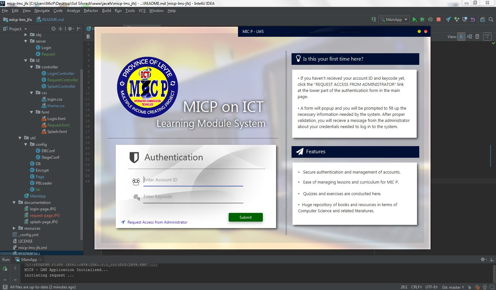
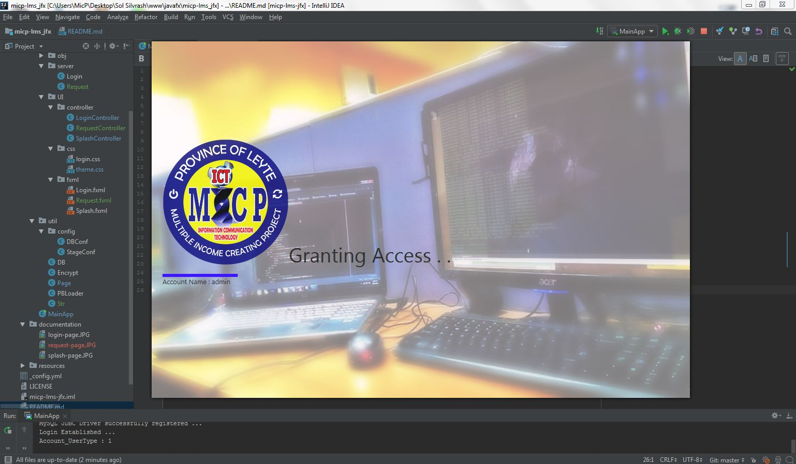

# MICP LMS (Learning Module System)

 

#### MIC P Learning Module System (JavaFX port)
Below are some list of features to be implemented in the system:
+ Centralized management of lessons and curriculum through the use of an JDBC backend
+ Management of student's attendance and activities.
+ to be concluded

### Current Status

#### Login Page
 

#### Splash Page

#### Request Access

_TODO : Main Interface of the system_

[ __[Click here to edit more](https://dillinger.io/)__ ]

